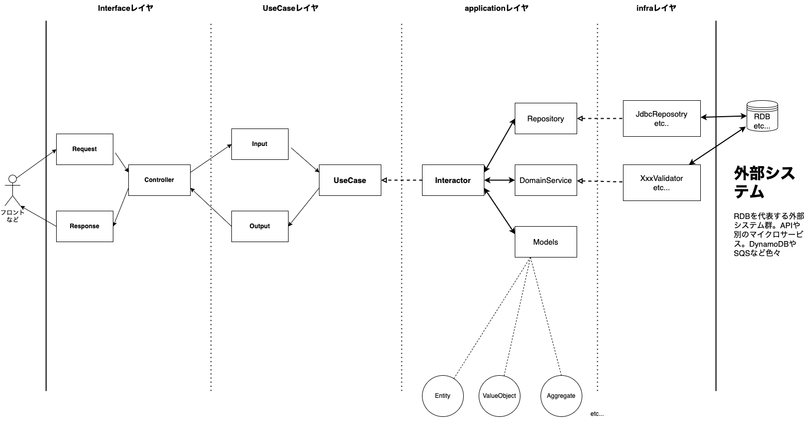

# バックエンドアーキテクチャ

BEのアーキテクチャについて説明する。

## 概要

このアプリケーションはClean Architectureをベースとしたレイヤ構造と、
DDDをベースにした設計になっている。

Clean Architectureとかに慣れていない人でも、アプリケーションアーキテクチャに嫌悪感がない人であれば、
一度実装の流れを掴めば苦もなく順応できるだろう。

このプロジェクトではモジュールでレイヤを分けているが、1モジュールの中でpackageを分け、開発者の努力によって
レイヤを守るようにしても良い。Frameworkの初期状態から、packageを意識的に分けるだけで実現できるので導入の
ハードルが低くなる。

モジュールで分けると、ビルドツールによって依存関係が定義できるので、レイヤ違反を犯しにくくなるメリットがある。

## フロー

このアプリケーションは基本的に下記のようなフローに従って実装されている。
レイヤ構成はClean Architectureの典型的なシナリオを参考にしており、多くの場合に対応でき、
一度慣れればほぼ同じパターンで実装していくことができる。
適切に設計されれば、複雑になりがちなフローの処理の実装は`Interactor`で中心的に扱われる。
つまり、処理の流れは `Interactor` さえ追えば分かるようになる。
また、後述するが、`Output` の実装の仕方によって、`UseCase` が起こしうる検査例外はその `UseCase` の `Output`
だけ見れば分かるようになっている。

流れもシンプルで例外なくこの流れで実装すれば（冗長になることは多々あれど）不用意に複雑になりすぎることは少ない。
※実際には単純な処理では `UseCase` を挟むと冗長になりすぎるので挟まないケースはまあまああるが、複数人で開発していると、
メンバーにはその判断が難しいと感じられてしまう場面が出てくるので、冗長でも全て `UseCase-Interactor` を実装する形式
も開発者を混乱させないというメリットがあるかもしれないと思っている。

実際に、いくつかのプロジェクトで、この構造を説明し導入したところ、プロジェクトのメンバーは割と早い段階で順応してくれた。



### 各要素の説明

#### Request

システム外部からのRequest用のモデル。
あまり凝る必要はない。play-jsonの標準的な利用で事足りる。
値オブジェクトにJSONを直接自動変換するようなことはScala界隈でやられがちだが、 あまりよく思っていない。
変換の実装コストはちょっと面倒と思うかもしれないが、実際にはほぼなく、普通に書いた方が簡単だ。
自動変換はその仕組みを作った人以外には理解し難くなる。新たに入ってきたメンバーに不要な学習コストが増えるだけだ。

`Input` モデルはここで作成して上げるのが通常は良いと考える。

実装例

```scala
import dev.tchiba.sdmt.core.boundedContext.{BoundedContextAlias, BoundedContextName, BoundedContextOverview}
import dev.tchiba.sdmt.usecase.boundedContext.create.CreateBoundedContextInput
import interfaces.json.{JsonRequest, JsonValidator}
import play.api.libs.json.{Json, OFormat}
import play.api.mvc.{BodyParser, PlayBodyParsers}

import scala.concurrent.ExecutionContext

case class CreateBoundedContextRequest(
   private val name: String,
   private val alias: String,
   private val overview: String
) extends JsonRequest {
  
  // 値オブジェクトへの変換はここで行う。
  // クラス内で投げられた例外（`RequestValidationError`）は、
  // JsonValidator.validate 内でBadRequestにして返すようにしている。
  private val boundedContextName: BoundedContextName = BoundedContextName.validate(name).leftThrow
  private val boundedContextAlias: BoundedContextAlias = BoundedContextAlias.validate(alias).leftThrow
  private val boundedContextOverview: BoundedContextOverview = BoundedContextOverview.validate(overview).leftThrow

  // Inputへの変換はここでやってしまうのが良いと今のところは考えている。
  // Controllerでやるのは少し面倒だし、ごちゃっとする。Requestクラスは実際のところデータ型を
  // 定義しているだけでそこまで重要なクラスでもなく、ここでやってあげてしまうのがちょうど良い。
  val input: CreateBoundedContextInput =
    CreateBoundedContextInput(boundedContextAlias, boundedContextName, boundedContextOverview)
}

object CreateBoundedContextRequest {
  // play jsonを利用するための定義
  implicit val jsonFormat: OFormat[CreateBoundedContextRequest] = Json.format[CreateBoundedContextRequest]
  
  def validateJson(implicit parse: PlayBodyParsers, ec: ExecutionContext): BodyParser[CreateBoundedContextRequest] =
    JsonValidator.validate
}
```

#### Response

#### Controller

#### Input

#### Output

#### UseCase

#### Interactor

#### Repository, DomainService, Models

#### JdbcRepository, XxxValidator, etc...


## 基本的な実装の流れ


## DDDの実装